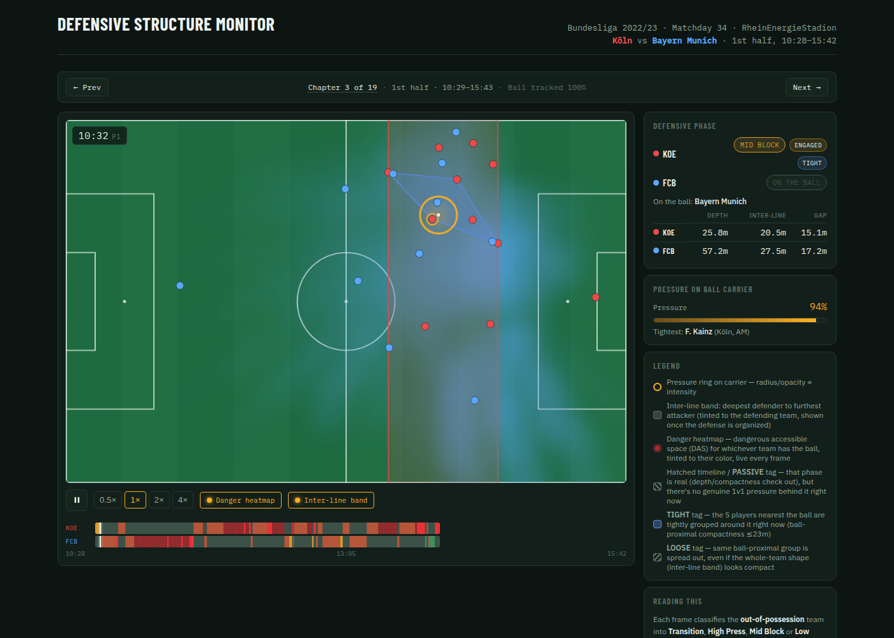
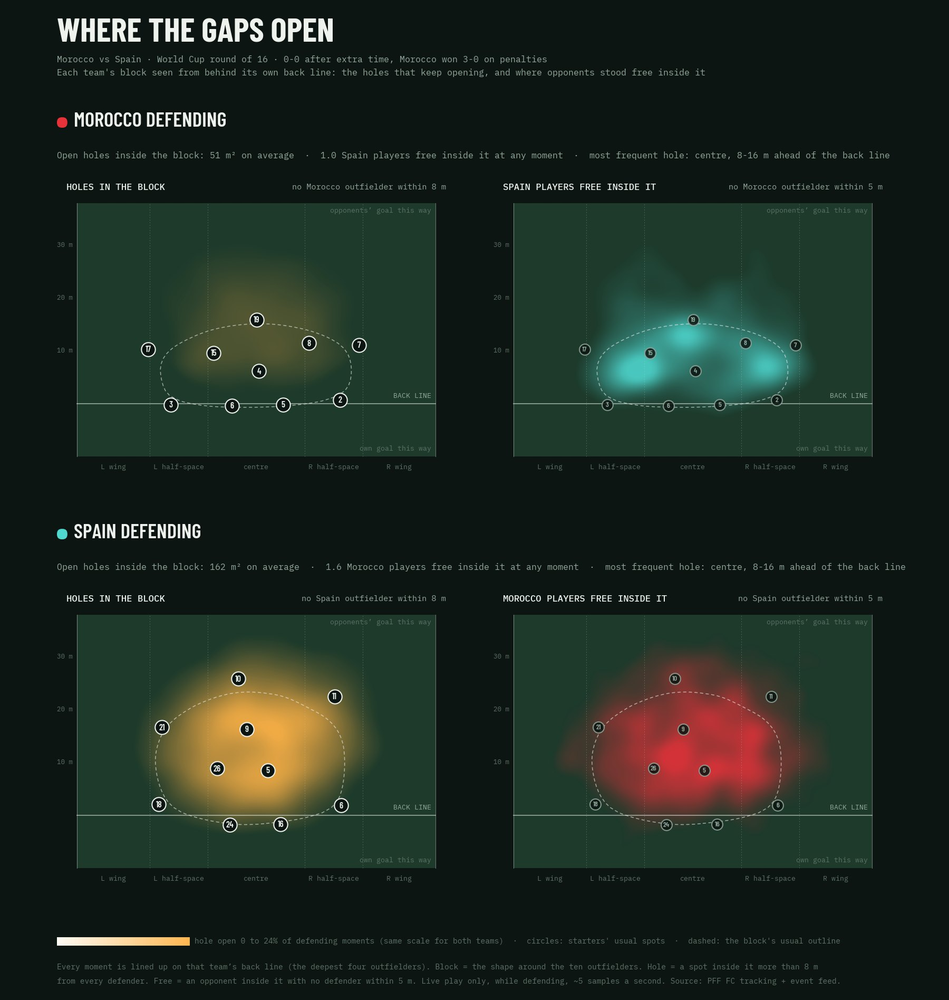
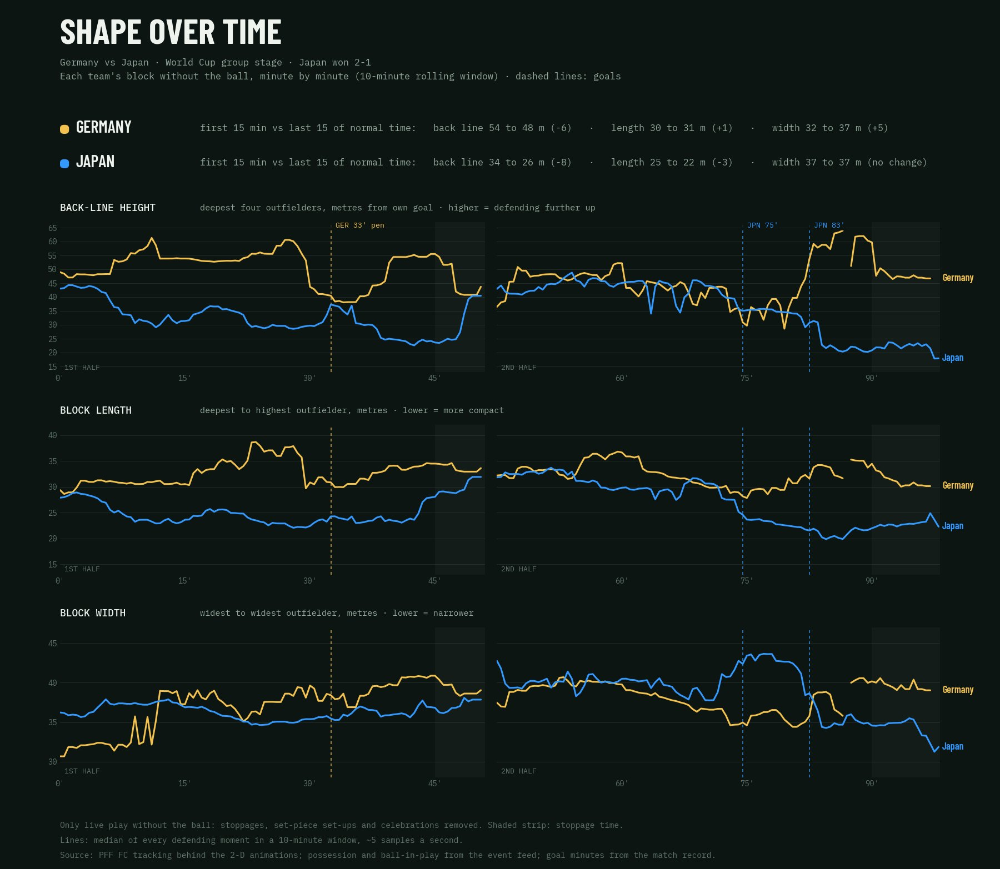
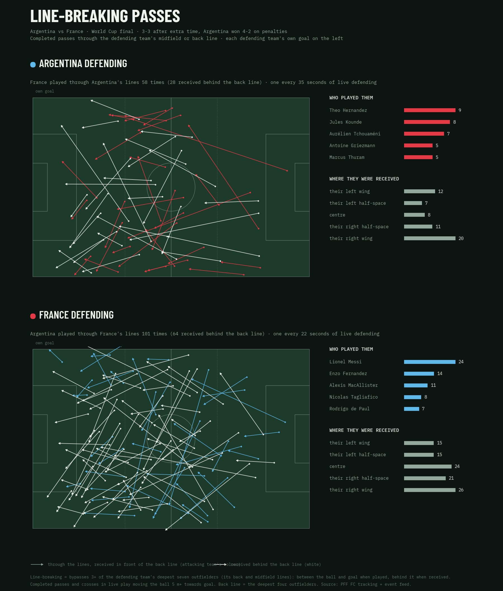
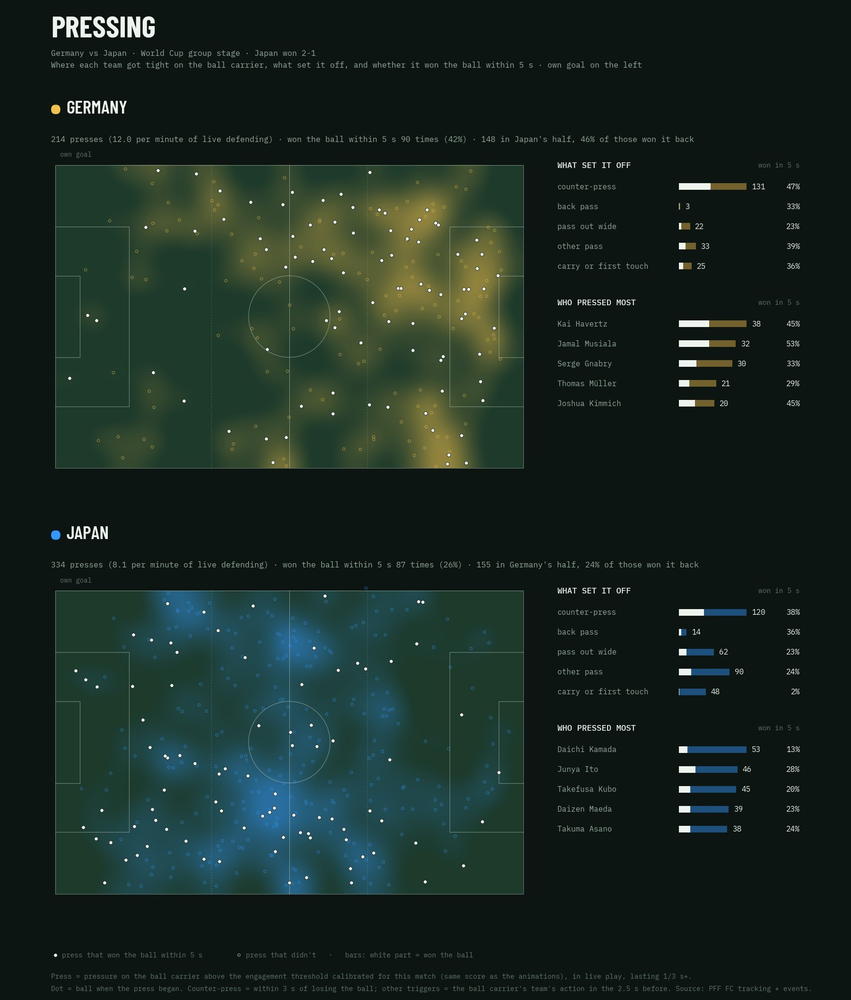

# Defensive Structure Model

Reads a football team's defensive structure from tracking data, frame by frame, across a full match. It shows what shape a team is in out of possession, how much pressure it puts on the ball, and where it leaves dangerous space that an opponent could exploit.

**Live site:** https://defensive-structure-model.netlify.app/



## What it does

For every frame of a match, the model:

1. **Classifies each team's defensive phase:** High Press, Mid Block, Low Block or Transition. It uses back-line depth and team compactness with fixed thresholds from the literature.
2. **Scores pressure on the ball carrier** from each defender's time to intercept, using their position, velocity, reaction time and own top speed. It also tags whether the press is ENGAGED or PASSIVE.
3. **Maps dangerous accessible space:** where the team in possession could realistically get the ball with one pass, weighted by how dangerous that spot is.
4. **Tags marking around the ball** as TIGHT or LOOSE, from the spread of the five defenders nearest the ball.

All of it is rendered as an animated 2-D match, split into five-minute chapters, with a scrubbable phase timeline. A set of match-level analyses sits on top: shape over time, where gaps open inside the block, line-breaking passes, chances conceded traced back to their start, turnovers, pressing triggers, and per-team scouting reports.

## Matches

| Match | Competition | Data |
|---|---|---|
| Morocco vs Spain | World Cup 2022, Round of 16 | PFF FC |
| France vs Morocco | World Cup 2022, Semifinal | PFF FC |
| Germany vs Japan | World Cup 2022, Group stage | PFF FC |
| Belgium vs Canada | World Cup 2022, Group stage | PFF FC |
| Argentina vs France | World Cup 2022, Final | PFF FC |
| Köln vs Bayern Munich | Bundesliga 2022/23, Matchday 34 | DFL open data |

## Example outputs

| Where the gaps open (Morocco vs Spain) | Shape over time (Germany vs Japan) |
|---|---|
|  |  |
| **Line-breaking passes (Argentina vs France)** | **Pressing (Germany vs Japan)** |
|  |  |

## How it was checked

- **Pressure score vs PFF analyst tags:** the mean score is 0.739 on moments analysts tagged as "under pressure", against 0.538 elsewhere. The ENGAGED/PASSIVE threshold separates the two with an AUC of 0.68 to 0.78 across five matches.
- **Phases vs PPDA:** PPDA is a passing-based pressing stat that doesn't use tracking. In organised defence, it rises from High Press to Mid Block to Low Block for both teams, as pressing theory predicts.
- **Marking tag:** the TIGHT/LOOSE candidate variable was tested against an independent outcome (ball won back within 5, 8 or 10 s). It didn't earn a place in the phase definition, so it ships only as a descriptive tag.
- **Broadcast footage prototype vs PFF tracking:**
  - median player position error 0.83 m
  - possession agreement 91%
  - pressure correlation 0.74
- **Bundesliga converter vs DFL's own possession flag:** they agree on 87% of live frames, and all 21 shots and 3 goals come through.

Full details: [docs/METHODOLOGY.md](docs/METHODOLOGY.md). Research basis: [docs/LITERATURE.md](docs/LITERATURE.md). The original write-up: [docs/WRITE-UP.md](docs/WRITE-UP.md).

## Repository layout

```
pipeline/    tracking cleanup (Kalman + RTS smoother), team shape, phase classification,
             pressure, engaged/passive, marking, danger heatmap, chapter export and build,
             match hub, the companion analyses (PPDA, space in behind, compactness)
templates/   HTML/JS shells the chapter and companion pages are built from
providers/   converters from other data formats into the layout the pipeline reads (DFL)
footage/     running the model on broadcast video: detection, camera calibration from
             pitch lines, team split, tracking, overlay rendering, benchmark vs PFF
docs/        methodology, literature, original write-up
examples/    sample outputs
```

## Data

No match data is included in this repository.

- **PFF FC World Cup 2022:** free, but access is by request through PFF FC, and the files are covered by PFF's terms.
- **DFL Bundesliga open data:** CC-BY 4.0, © DFL. Download it from [figshare](https://doi.org/10.6084/m9.figshare.28196177) and convert it with `providers/dfl_to_pff.py`.

## Status

This repository is being assembled from project backups.
- **Rebuilding:** the match-level analysis views, the per-team scouting reports and the one-command match runner are being re-added.
- **Paths:** file paths in `pipeline/config.py` still point at the original working environment and are being made configurable.

Planned next: an Opta converter, and carrying PFF's "estimated position" flag into the animation.

## License

Code: MIT (see [LICENSE](LICENSE)). Data and the images derived from it remain under their providers' terms.
